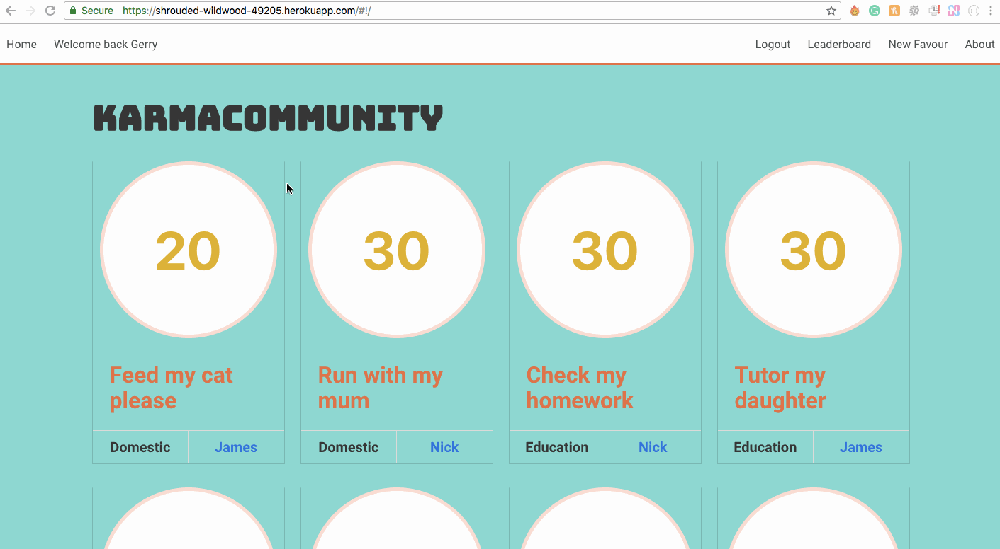

# Project 3 - A MEAN Stack App

# GA WDI Project Three - Karma Community

This was the third project assignment during our time on General Assembly's Web Development Immersive Course (week 7-8). This was a group project build by two team members ([Martin](https://github.com/cerbeh) & [Stevan](https://github.com/stevanpopo)). We built a community good-will app that:
* Allows users to ask favours from members their community.
* Choose a selected volunteer for a task (with SMS notifications of choice and approval).
* Gain 'karma coins' based on completed favours.

##### [Visit the website](https://karma-community.herokuapp.com/) to check it out.

## Brief
Design and build a MEAN stack app (MongoDB, Express, Angular, Node.js) with:
* At least two models.
* A persistent database (with all CRUD actions on records).
* Your own API on the back-end.
* User authentification (registration and session creation).
* RESTful routes.
* Angular on the front-end.
* A CSS framework on the front-end.
* Deployed on Heroku.

## Build Process

### Inspiration
In order to gain inspiration for the web app we:
* Listed areas of interest for both of us and brainstormed.
* Discussed a number of ideas around sport, education and community.

### Plan
Using Trello we:
* Created a list of all the features we wanted to create.
* Organized the list by which elements were crucial for MVP (phase one features) and which could be added in later (phase two features).
* Sat next to each other and constantly communicated to assign tasks and check progress.

### Build
The build phase involved getting in front of our computers and working through the Trello board. If ever we ran into problems we would both discuss a solution and move forward.

### Highlights
* **External APIs** - The brief left third-party APIs as a bonus, but our idea lended itself very nicely to their use. We included Google Maps API for locations and Twilio for SMS notifications when a volunteer is selected.
* **Volunteer and chosen volunteer logic** - We created some nice logic and a process around having several volunteers per favour and being able to choose and select a single volunteer, as well as verify that they did complete the favour.

## Moving Forward / Future Features
Some features we could add moving forward:
* Allow the selecting of multiple volunteers per job.
* Allow for repeat favours (weekly/monthly).
* Allow for volunteer cancellation and re-selection.

## Contact Us
Feel free to ask us questions about this project or anything else:
- Stevan [Github](https://github.com/stevanpopo) | [Twitter](https://twitter.com/StevanPopo) | [LinkedIn](https://www.linkedin.com/in/stevanpopovic/) | [stevanpopovic.com](http://www.stevanpopovic.com/)
- Martin [Github](https://github.com/cerbeh)
